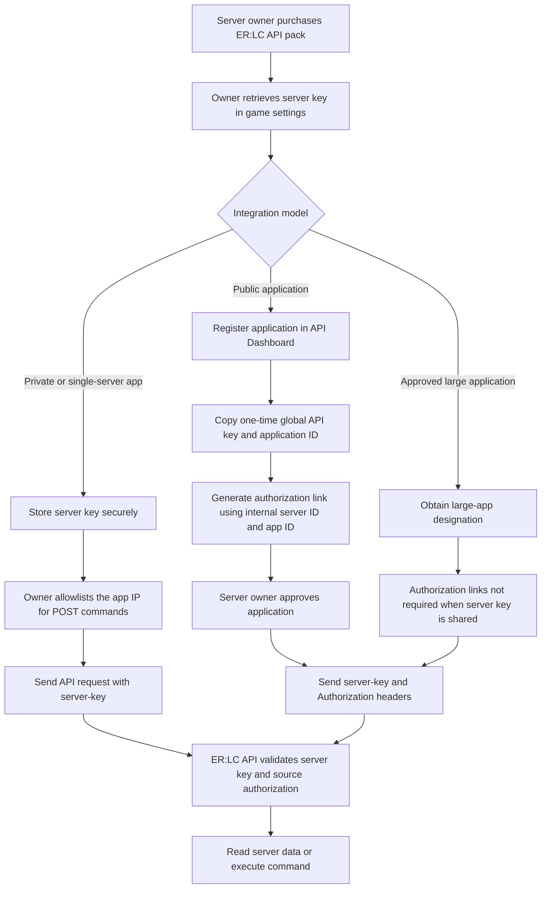
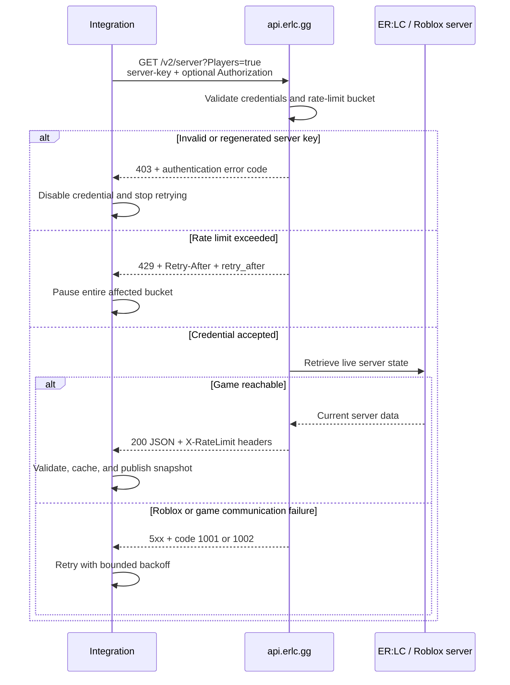

# ER:LC Private Server API Documentation Research Report

## Executive summary

The ER:LC Private Server API is a relatively small REST interface for querying and managing Emergency Response: Liberty County private servers. The current documentation positions `GET /v2/server` as the preferred read endpoint: it always returns core server metadata and can optionally aggregate players, staff, logs, queue, emergency calls, and vehicles into one response. Remote command execution remains on `POST /v1/server/command`, and ban retrieval remains available only through the older `GET /v1/server/bans` route. The published v1 OpenAPI document contains eleven server operations, while the current human-facing API reference highlights only the v2 aggregate read and v1 command operations. Supporting documentation also describes `POST /v1/api-key/reset` and `GET /maps`, giving thirteen documented HTTP operations in total. citeturn5search1turn6view0turn9view0turn9view2turn9view3turn12view2turn15view1

Authentication is based primarily on a static per-server credential supplied through the `server-key` header. Public applications add a global API key in the `Authorization` header, but this global key does not replace the server key. Command authorization adds a third layer: a private, single-server integration should operate from an owner-allowlisted IP address, while a public application may require the server owner to approve an authorization link containing the internal server ID and application ID. Large applications are exempted from authorization links when a server has shared its server key with them. There is no documented OAuth-style access-token exchange, refresh token, bearer-token lifetime, or scope model. citeturn7view2turn12view0turn6view1turn13view0turn6view2

Rate limiting is deliberately dynamic. The documentation says limits vary by application and server and instructs clients to use the returned `X-RateLimit-*` headers rather than hardcode a global quota. The only route-specific figure disclosed is an expressly changeable example of one command request per five seconds. A `429` response includes both `Retry-After` and a JSON `retry_after` value; continuing to send traffic can result in multi-hour invalid-request blocks or Cloudflare enforcement. Repeated use of an invalid server key can also lead to an IP ban. citeturn12view3

The API has no documented pagination. Collection responses are returned as complete arrays or objects, and the v2 endpoint instead uses boolean expansion parameters to control payload composition. That makes v2 efficient for state snapshots but requires careful polling, caching, response-size monitoring, and defensive schema handling. The documentation does not define log retention, collection ordering, maximum collection sizes, conditional requests, cursors, or incremental synchronization. citeturn7view2turn9view1turn9view2turn9view3

Webhooks are supported for semicolon-prefixed in-game messages and emergency calls. Every webhook must be delivered over HTTPS and verified with Ed25519 using the exact timestamp string plus the raw, unmodified request-body bytes. The documentation provides the public key and signature headers, but it does not publish formal webhook payload schemas, retry behavior, timeout policy, ordering guarantees, event identifiers, duplicate-delivery semantics, or a required timestamp-freshness window. citeturn10view0

For production use, the most important design decisions are to treat the server key as a highly privileged secret, isolate command execution behind application-level authorization and command allowlists, implement bucket-aware rate limiting, stop permanently after repeated `403` responses for a server key, verify webhook signatures before JSON parsing, and hide inconsistencies in the documented response and error formats behind a typed internal adapter. The official documentation explicitly warns that the server key has co-owner-equivalent access and can enable destructive actions without a clear in-game audit trail. citeturn13view1turn4search9turn12view3

## API scope, versions, and source map

The API base URL published by the v1 OpenAPI specification is `https://api.erlc.gg`. Current getting-started guidance directs new integrations to the `/v2/` API where possible, while allowing v1 use for capabilities not yet available in v2. In practice, the current split is:

| API surface | Recommended role | Version status |
|---|---|---|
| `GET /v2/server` | Primary server-state and telemetry read | Preferred current read API |
| `POST /v1/server/command` | Remote in-game command execution | Still current; no v2 equivalent is documented |
| `GET /v1/server/bans` | Ban-list retrieval | Still needed because v2 does not expose a `Bans` expansion |
| Other v1 reads | Compatibility and legacy integrations | Mostly superseded by v2; `GET /v1/server/staff` is explicitly deprecated |
| `POST /v1/api-key/reset` | Global application-key rotation | Supporting application-management route |
| `GET /maps` | Current official map-image metadata | Supporting public resource; schema is not documented |

citeturn5search2turn7view0turn6view0turn9view0turn9view3turn12view2turn15view1

The principal official sources reviewed were the [Overview and Access page](https://apidocs.erlc.gg/introduction), [v2 server endpoint reference](https://apidocs.erlc.gg/api-reference/fetch-server-information), [command endpoint reference](https://apidocs.erlc.gg/api-reference/run-a-command-in-game-as-virtual-server-management), [v1 OpenAPI specification](https://api.erlc.gg/internal/docs/apispec.v1.json), [v2 OpenAPI specification](https://api.erlc.gg/internal/docs/apispec.v2.json), [rate-limit reference](https://apidocs.erlc.gg/rate-limits), [error-code reference](https://apidocs.erlc.gg/error-codes), [public-application guide](https://apidocs.erlc.gg/creating-public-applications), [authorization-link guide](https://apidocs.erlc.gg/creating-authorization-links), [webhook guide](https://apidocs.erlc.gg/event-webhooks), and [API-use guidelines](https://apidocs.erlc.gg/policies/aup). The official documentation index lists both OpenAPI specifications but exposes only two operations in its current human-facing “API Reference” navigation. citeturn1view0turn7view0

### Resource model

The API is organized around a single private-server resource rather than conventional independent REST resources. In v1, server metadata, players, staff, logs, bans, queue, and vehicles have separate subpaths. In v2, most of these are optional expansions of `GET /v2/server`. This is closer to a snapshot/query API than to a CRUD API: there are no documented endpoints for creating, replacing, patching, or deleting server resources. The only documented state-changing server operation is command execution. citeturn7view2turn9view0turn9view2turn9view3

The v2 consolidation reduces request count but introduces a trade-off. Fetching all expansions creates a potentially large and fast-changing document, whereas requesting only the specific expansions needed reduces bandwidth and parsing work. Because the docs provide no entity-level `ETag`, `Last-Modified`, incremental cursor, or change token, applications must establish their own snapshot comparison and cache-invalidation logic. This is an architectural inference from the documented endpoint shape and the absence of any documented conditional or incremental retrieval mechanism. citeturn7view2turn12view3

## Endpoint catalog and schemas

### Comprehensive operation inventory

The table below catalogs every HTTP operation identifiable in the current official API reference, the published v1 OpenAPI document, and supporting official pages.

| Resource | Operation | Method and path | Inputs | Authentication | Primary successful response |
|---|---|---|---|---|---|
| Server aggregate | Fetch server information | `GET /v2/server` | Nine optional boolean query parameters | Required `server-key`; optional `Authorization` for public apps | Core server object plus requested expansions citeturn7view2 |
| Server metadata | Fetch legacy server status | `GET /v1/server` | No parameters documented | Required `server-key` | `Name`, `OwnerId`, `CoOwnerIds`, player counts, `JoinKey`, account-verification setting, team-balance flag citeturn9view0 |
| Players | Fetch players | `GET /v1/server/players` | No parameters documented | Required `server-key` | Array of player objects citeturn9view0 |
| Staff | Fetch staff | `GET /v1/server/staff` | No parameters documented | Required `server-key` | `CoOwners`, `Admins`, `Mods`; route marked deprecated citeturn9view0 |
| Join logs | Fetch join and leave events | `GET /v1/server/joinlogs` | No parameters documented | Required `server-key` | Array of `Join`, `Timestamp`, `Player` records citeturn9view1 |
| Queue | Fetch queued players | `GET /v1/server/queue` | No parameters documented | Required `server-key` | Array of Roblox user IDs citeturn9view2 |
| Kill logs | Fetch kills | `GET /v1/server/killlogs` | No parameters documented | Required `server-key` | Array of `Killed`, `Timestamp`, `Killer` records citeturn9view2 |
| Command logs | Fetch executed commands | `GET /v1/server/commandlogs` | No parameters documented | Required `server-key` | Array of `Player`, `Timestamp`, `Command` records citeturn9view2 |
| Moderator calls | Fetch moderator calls | `GET /v1/server/modcalls` | No parameters documented | Required `server-key` | Array of `Caller`, optional `Moderator`, `Timestamp` records citeturn9view3 |
| Bans | Fetch bans | `GET /v1/server/bans` | No parameters documented | Required `server-key` | Object documented with a `PlayerId` string field citeturn9view3 |
| Vehicles | Fetch spawned vehicles | `GET /v1/server/vehicles` | No parameters documented | Required `server-key` | Array of vehicle objects citeturn9view3 |
| Commands | Execute an in-game command | `POST /v1/server/command` | Required JSON body with `command` string | Required `server-key`; command-source authorization also enforced | `{ "message": "Success" }` citeturn6view0 |
| Global keys | Rotate a global application key | `POST /v1/api-key/reset` | No body documented | Current global key in `Authorization` | New global key, viewable once; exact schema unspecified citeturn12view2 |
| Maps | Fetch map-image list | `GET /maps` | No parameters documented | Not specified | Current list of map images; schema unspecified citeturn15view1 |

The documentation also exposes two non-REST integration routes. The browser authorization URL has the form `/server-owners/server/{internalServerId}/authorize/{applicationId}` and is intended for an owner-facing approval flow, not ordinary API calls. Separately, the documentation site offers a remote MCP server at `https://apidocs.erlc.gg/mcp` for AI tools to search and retrieve documentation; it does not operate on private-server state. citeturn6view1turn6view3

### Key endpoint comparison

| Endpoint | Path | Method | Auth required | Documented rate limit | Primary response fields |
|---|---|---:|---|---|---|
| Aggregated server snapshot | `/v2/server` | GET | `server-key`; optional global `Authorization` | Dynamic global/per-app/per-server bucket | `Name`, owner/co-owner IDs, player counts, join key, verification requirement, team balance; optional telemetry expansions citeturn7view2turn12view3 |
| Execute command | `/v1/server/command` | POST | `server-key`; trusted IP or approved application source | Example: one request per five seconds, subject to change | `message`; on some failures, `commandId` citeturn6view0turn12view3turn13view0 |
| Players | `/v1/server/players` | GET | `server-key` | Dynamic; inspect response headers | Array with `Player`, `Permission`, nullable `Callsign`, `Team` citeturn9view0turn12view3 |
| Staff | `/v1/server/staff` | GET | `server-key` | Dynamic; inspect response headers | Co-owner IDs and administrator/moderator maps; deprecated citeturn9view0turn12view3 |
| Join logs | `/v1/server/joinlogs` | GET | `server-key` | Dynamic; inspect response headers | `Join`, `Timestamp`, `Player` citeturn9view1turn12view3 |
| Bans | `/v1/server/bans` | GET | `server-key` | Dynamic; inspect response headers | Ban object; exact dynamic-key semantics are unclear citeturn9view3turn12view3 |
| Rotate global key | `/v1/api-key/reset` | POST | Global key in `Authorization` | Unspecified | Newly generated global API key citeturn12view2 |
| Map image list | `/maps` | GET | Unspecified | Unspecified | Current official map-image list; schema unspecified citeturn15view1 |

### Aggregated v2 server request

`GET /v2/server` has no required query parameters. Each supported query parameter is a boolean expansion switch, with `true` causing the corresponding field to appear in the successful response. The documentation does not specify a default other than omission, nor does it document behavior for `false`, mixed-case values, `1`, empty values, or unknown query parameters. citeturn7view2

| Query parameter | Required | Type | Effect |
|---|---:|---|---|
| `Players` | No | Boolean | Includes players, their team/status information, wanted stars, and location data |
| `Staff` | No | Boolean | Includes administrators, moderators, and helpers |
| `JoinLogs` | No | Boolean | Includes join/leave log entries |
| `Queue` | No | Boolean | Includes queued Roblox user IDs |
| `KillLogs` | No | Boolean | Includes kill records |
| `CommandLogs` | No | Boolean | Includes command records |
| `ModCalls` | No | Boolean | Includes moderator-call records |
| `EmergencyCalls` | No | Boolean | Includes emergency-call data |
| `Vehicles` | No | Boolean | Includes spawned-vehicle data |

citeturn7view2

The base response fields are documented as required:

| Field | Type | Meaning |
|---|---|---|
| `Name` | String | Private-server name |
| `OwnerId` | Integer | Roblox user ID of the owner |
| `CoOwnerIds` | Integer array | Roblox user IDs of co-owners |
| `CurrentPlayers` | Integer | Current player count |
| `MaxPlayers` | Integer | Server capacity |
| `JoinKey` | String | Private-server join key |
| `AccVerifiedReq` | String | Account-verification requirement |
| `TeamBalance` | Boolean | Whether team balance is enabled |

citeturn7view2

The optional v2 expansions have the following documented or example-derived shapes:

| Expansion | Item or object fields |
|---|---|
| `Players[]` | `Team`, `Player`, `Callsign`, `Location`, `Permission`, `WantedStars` |
| `Players[].Location` | `LocationX`, `LocationZ`, `PostalCode`, `StreetName`, `BuildingNumber` |
| `Staff` | `Admins`, `Mods`, `Helpers`, each shown as an object mapping numeric Roblox ID strings to usernames |
| `JoinLogs[]` | `Join`, `Timestamp`, `Player` |
| `Queue[]` | Integer Roblox user IDs |
| `KillLogs[]` | `Killed`, `Timestamp`, `Killer` |
| `CommandLogs[]` | `Player`, `Timestamp`, `Command` |
| `ModCalls[]` | `Caller`, `Moderator`, `Timestamp` |
| `EmergencyCalls[]` | `Team`, `Caller`, `Players`, two-element `Position`, `StartedAt`, `CallNumber`, `Description`, `PositionDescriptor` |
| `Vehicles[]` | `Name`, `Owner`, `Plate`, `Texture`, `ColorHex`, `ColorName` |

citeturn7view1turn7view3

Player location coordinates use the center of the game map as `(0,0)`. Positive `LocationX` moves right, negative `LocationX` moves left, positive `LocationZ` moves down, and negative `LocationZ` moves up. The official map images are documented as 3,121 by 3,121 pixels. citeturn15view0turn15view1

### Legacy v1 read schemas

The v1 OpenAPI specification defines no query, path, or body parameters for its GET operations. All are protected by `ServerKeyAuth`, an API-key security scheme in the `server-key` header. Every v1 GET operation formally lists `200` and `403` responses, although the specification gives detailed JSON schemas only for `200`. citeturn9view0turn9view1turn9view2turn9view3turn2view1

| Route | Successful response schema |
|---|---|
| `/v1/server` | Object: `Name:string`, `OwnerId:integer`, `CoOwnerIds:integer[]`, `CurrentPlayers:integer`, `MaxPlayers:integer`, `JoinKey:string`, `AccVerifiedReq:string`, `TeamBalance:boolean` |
| `/v1/server/players` | Array of `{ Player:string, Permission:string, Callsign:string|null, Team:string }` |
| `/v1/server/staff` | Object with `CoOwners:integer[]`, `Admins:object<string,string>`, `Mods:object<string,string>`; deprecated |
| `/v1/server/joinlogs` | Array of `{ Join:boolean, Timestamp:integer, Player:string }` |
| `/v1/server/queue` | Integer array |
| `/v1/server/killlogs` | Array of `{ Killed:string, Timestamp:integer, Killer:string }` |
| `/v1/server/commandlogs` | Array of `{ Player:string, Timestamp:integer, Command:string }` |
| `/v1/server/modcalls` | Array of `{ Caller:string, Moderator:string|null, Timestamp:integer }` |
| `/v1/server/bans` | Object with a documented `PlayerId:string` property; the example value is a username, making the model ambiguous |
| `/v1/server/vehicles` | Array of `{ Texture:string|null, Name:string, Owner:string }` |

citeturn9view0turn9view1turn9view2turn9view3

The v1 OpenAPI schemas do not consistently declare `required` arrays, numeric formats, minimums, string-length limits, enum constraints, or `additionalProperties: false`. Consumers should therefore treat extra fields as forward-compatible additions and should not assume that the presence of a property in `properties` makes it guaranteed, except where the human-facing v2 page explicitly labels base fields as required. citeturn9view0turn9view2turn7view2

### Command request and response

`POST /v1/server/command` accepts `application/json` containing a `command` string. The request body is formally marked required. Although the OpenAPI schema does not place `command` in a JSON Schema `required` array, the endpoint page treats it as necessary and shows a missing-command failure. This is a documentation/schema inconsistency that generated SDKs may not catch. citeturn6view0turn9view3

```http
POST /v1/server/command HTTP/1.1
Host: api.erlc.gg
server-key: <SERVER_KEY>
Authorization: <GLOBAL_API_KEY_IF_PUBLIC_APP>
Content-Type: application/json
Accept: application/json

{
  "command": ":h Hey everyone!"
}
```

A successful response is:

```http
HTTP/1.1 200 OK
Content-Type: application/json
X-RateLimit-Bucket: command-<server-key>
X-RateLimit-Limit: <dynamic>
X-RateLimit-Remaining: <dynamic>
X-RateLimit-Reset: <unix-epoch>

{
  "message": "Success"
}
```

The endpoint page also documents `400` for a missing command, `422` when the private server is offline, and `500` when communication with Roblox fails. Offline and communication failures include a `commandId` intended for troubleshooting. The v1 OpenAPI specification additionally declares `403 Unauthorized`. citeturn6view0turn2view1

```json
{
  "message": "The private server is currently offline.",
  "commandId": "ecfd9342-0acd-4485-bf32-e654b4a829fd"
}
```

Commands should be considered asynchronous side effects from the integration’s perspective even though the HTTP request returns synchronously: the documentation confirms that the request was accepted or encountered an immediate communication problem, but it does not define an idempotency key, command-status lookup, execution receipt, or exactly-once guarantee. This is an inference from the documented contract and should be treated as an implementation risk rather than as a stated server behavior. citeturn6view0

## Authentication, authorization, and token flow

### Credential types

The API has two documented API credentials and one command-source authorization mechanism:

| Mechanism | Purpose | Where obtained | Transmission |
|---|---|---|---|
| Server key | Identifies and grants access to one private server | ER:LC private-server settings after purchasing the API pack | `server-key` header on private-server API calls |
| Global API key | Identifies a public or large application and allows app-specific rate treatment | API Dashboard for public apps, or approval process for large apps | Raw value in `Authorization` header |
| IP/application authorization | Determines whether a source may execute POST commands | Server Owner Dashboard IP allowlist or owner-facing application authorization link | Evaluated server-side; no additional request field is documented |

citeturn0view0turn12view0turn12view2turn13view0

The server key is static until regenerated. It is not a session token and has no documented expiry time, refresh endpoint, scope restriction, or per-operation privilege. The docs state that it grants approximately co-owner-level API access and can permit destructive actions such as mass bans without a clear audit trail identifying the actor. citeturn13view1

The global application key is also static. Public-app keys are shown only once and must be regenerated if lost. The docs instruct applications to place the key directly in `Authorization`; they do not specify a `Bearer` prefix, and the reset example likewise sends the raw key. The global key identifies the application and may affect rate limits, but calls still need the target server’s `server-key`. citeturn12view0turn12view2turn7view2

### Authorization flow

The following diagram combines the documented private-integration, public-application, and large-application paths. citeturn13view0turn12view0turn6view1turn6view2



For public applications that execute remote commands, the documented browser URL is:

```text
https://api.erlc.gg/server-owners/server/[INTERNAL_SERVER_ID]/authorize/[YOUR_APPS_ID]
```

The application must first obtain the user’s server key and extract its internal server ID. The documentation says that the server-key anatomy is illustrated in an image, but its text does not define the exact encoding, delimiter, parser, or validation rules for extracting that ID. citeturn6view1turn13view1

This authorization model is not conventional OAuth. There is no documented redirect URI, authorization code, access-token exchange, `state` parameter, PKCE, scope list, refresh token, consent-result API, or revocation webhook. Approval appears to authorize the application identity to issue commands against a server when it also possesses the server key. Applications should not invent OAuth assumptions around this flow. citeturn6view1turn12view0

### Sample API-call flow

A robust client should treat successful data retrieval, rate limiting, stale credentials, and upstream Roblox failures as distinct control paths. citeturn12view3turn16view0turn7view2



## Rate limits, errors, pagination, and webhooks

### Rate-limit model

By default, rate limits are applied by IP address. The documentation also describes limits as varying by application and server, with global application keys allowing application-specific identification and potentially higher volume. Some routes use dedicated buckets; a non-`global` `X-RateLimit-Bucket` identifies such a route-specific limit. citeturn12view3turn12view2

| Response header | Meaning |
|---|---|
| `X-RateLimit-Bucket` | Bucket that governed the request, such as `global` or `command-[Server-Key]` |
| `X-RateLimit-Limit` | Total requests allowed in the active window |
| `X-RateLimit-Remaining` | Remaining requests in that window |
| `X-RateLimit-Reset` | Epoch timestamp at which the current window resets |
| `Retry-After` | Seconds to wait after a `429` response |

citeturn12view3turn2view1

A `429` response also includes a JSON `retry_after` field. The client must cease requests immediately and wait the full indicated duration. Continuing to request during the blocked period can lead to an invalid-request block lasting several hours, followed by Cloudflare enforcement for persistent abuse. citeturn12view3

A production scheduler should maintain counters by the returned bucket identifier rather than merely by URL. On every response, it should atomically update the bucket limit, remaining count, and reset time. On `429`, `Retry-After` should take precedence; retries should resume after the full delay, ideally with a small random jitter to avoid synchronized retries from multiple workers. The jitter recommendation is an implementation best practice; the requirement to stop and honor the complete delay comes from the official docs. citeturn12view3

The docs explicitly advise against shared-IP services such as BotGhost because unrelated applications can collide in the same IP-based quota. A dedicated egress IP, or a controlled NAT pool with centralized request scheduling, is the safer production deployment pattern. citeturn12view3

### HTTP statuses and API error codes

The error reference defines machine-readable numeric codes, but it does not provide a complete one-to-one mapping from each code to an HTTP status. Endpoint pages and the OpenAPI specification must therefore be combined with the general error table. citeturn16view0turn6view0turn7view1turn2view1

| Code | Category | Documented meaning | Recommended client treatment |
|---:|---|---|---|
| `0` | System | Unknown error | Record request context; retry only if safe; escalate if persistent |
| `1001` | System | Error communicating with Roblox or the in-game server | Bounded retry with backoff |
| `1002` | System | Internal system error | Bounded retry with backoff |
| `2000` | Authentication | Missing server key | Configuration failure; do not retry unchanged |
| `2001` | Authentication | Incorrectly formatted server key | Configuration failure; note documentation conflict below |
| `2002` | Authentication | Invalid or expired server key | Disable key and require replacement |
| `2003` | Authentication | Invalid global API key | Stop public-app traffic and rotate or repair key |
| `2004` | Authentication | Server key banned from API access | Stop traffic and escalate |
| `3001` | Request | No valid command in request body | Correct payload; no blind retry |
| `3002` | Request | Target server offline | Delay until server has players |
| `4000` | Access | Source not authorized for this action | Complete IP or application authorization |
| `4001` | Rate limit | Rate limited | Honor `Retry-After` exactly |
| `4002` | Access | Command is restricted | Do not retry unchanged |
| `4003` | Access | Message is prohibited | Reject or sanitize user input |
| `9998` | Special | Resource is restricted | Treat as non-retryable without privilege change |
| `9999` | Special | In-game module is outdated | Kick all players, then retry as instructed |

citeturn16view0

There is a significant documentation inconsistency around code `2001`. The general error table defines it as an incorrectly formatted `server-key`, while the v2 server endpoint displays a `400` example using code `2001` for `Duplicate query parameter: Players`. Code-based handlers should therefore also inspect HTTP status and message text rather than assuming `2001` has a single stable meaning. citeturn16view0turn7view1

Error envelopes are not uniform:

```json
{
  "code": 2001,
  "message": "Duplicate query parameter: Players"
}
```

```json
{
  "error": "Error communicating with Roblox, please try again. [trace_123456]",
  "code": 1001
}
```

```json
{
  "message": "Error communicating with Roblox",
  "commandId": "ecfd9342-0acd-4485-bf32-e654b4a829fd"
}
```

All three forms appear in official endpoint examples. A resilient error decoder should support `code`, `message`, `error`, `commandId`, `retry_after`, and unexpected additional fields, while preserving the raw body for diagnostics. citeturn7view1turn6view0turn12view3

Repeated `403` responses for the same server key require special handling. The docs state that old keys return `403` after regeneration and that repeated invalid-key requests can produce an IP ban. After a small, conservative threshold, the integration should mark the credential disabled and stop all automated calls until the owner supplies a replacement. citeturn12view3

### Pagination and collection behavior

No endpoint documents page numbers, cursors, `limit`, `offset`, continuation tokens, `Link` headers, or next-page URLs. The v1 endpoints return full arrays or objects; v2 returns requested collections inline. Pagination must therefore be recorded as **not supported or not documented**, rather than assumed absent at the implementation level. citeturn7view2turn9view1turn9view2turn9view3

The documentation also leaves the following collection semantics undefined:

| Area | Missing contract |
|---|---|
| Log retention | How far back join, kill, command, or moderator-call logs extend |
| Ordering | Whether arrays are oldest-first, newest-first, or unordered |
| Maximum size | Upper bounds on logs, players, queue, or vehicles |
| Duplicate events | Whether repeated records can appear |
| Snapshot consistency | Whether expansions are captured atomically at one point in time |
| Empty values | Whether absent data is represented by omission, `null`, empty array, or empty object in every case |
| Time units | Timestamps appear to be Unix integers, but precision and timezone treatment are not formally defined |

The examples strongly suggest Unix-second timestamps, but only the rate-limit reset header is expressly described as an epoch timestamp; application code should not rely on undocumented precision without fixtures and runtime validation. citeturn12view3turn7view1turn9view1

### Webhook support

A server owner configures a webhook by placing an HTTPS endpoint in the private-server settings. ER:LC validates the URL before saving it, and all subsequent deliveries are JSON `POST` requests signed with Ed25519. citeturn10view0

Each signed request includes:

```text
X-Signature-Ed25519: <hex-encoded-signature>
X-Signature-Timestamp: <unix-timestamp-string>
```

The signature input is:

```text
UTF8(timestamp_header_exactly_as_received) || raw_request_body_bytes
```

The receiver must decode the signature as hexadecimal, not Base64, and verify it against the published SPKI-encoded Ed25519 public key:

```text
MCowBQYDK2VwAyEAjSICb9pp0kHizGQtdG8ySWsDChfGqi+gyFCttigBNOA=
```

A `2xx` response should be returned only after successful verification; missing, malformed, or invalid signature data should produce a `4xx`. The docs specifically warn not to reserialize parsed JSON, insert separators, decode the signature as Base64, or allow the framework to consume the body before raw bytes are captured. citeturn10view0

The currently documented webhook-producing events are:

| Event family | Trigger |
|---|---|
| Custom in-game command/message | A game message beginning with `;` |
| Emergency call | Creation or occurrence of an emergency call event |

The webhook mechanism is explicitly not intended to replace HTTP polling. citeturn10view0

For production, signature verification should be followed by a local timestamp-age check and a replay cache keyed by signature or a body hash. This closes a replay gap, but it is an application-level hardening measure: the ER:LC documentation supplies a timestamp header without specifying an allowed clock skew, maximum age, nonce, or event ID. The receiver should therefore choose and document its own tolerance rather than claiming that a particular window is required by ER:LC. citeturn10view0

## SDKs, examples, and integration patterns

### Official examples and tooling

The endpoint pages provide direct request examples for:

| Language or tool | HTTP library/style shown |
|---|---|
| cURL | Command-line HTTP |
| Python | `requests` |
| JavaScript | Native `fetch` |
| PHP | cURL extension |
| Go | `net/http` |
| Java | Unirest |
| Ruby | `Net::HTTP` |

citeturn7view0turn6view0

No first-party ER:LC SDK, generated client package, official package namespace, or official client-version compatibility matrix is identified in the documentation. The two machine-readable OpenAPI specifications are therefore the best official starting point for generating internal clients, but generated code should be patched for documented gaps such as missing `required` constraints, inconsistent errors, and v2/v1 split routing. citeturn1view0turn9view0turn9view3

The documentation site also publishes an MCP server for AI-assisted documentation search. Mintlify-compatible tools such as Claude Desktop or Cursor can be pointed at the MCP endpoint to search pages, fetch sections, and navigate the documentation structure. This is useful for documentation retrieval and developer assistance, but it is not a replacement for the ER:LC runtime API or a supported application SDK. citeturn6view3

### Partner clients

The official partner-client page currently names Melonly and Sonoran and describes them as offering moderation, management, and CAD capabilities. The documentation warns that ER:LC does not support these third-party products and instructs owners to evaluate each provider’s privacy policy, terms, maintenance, and reputation before sharing a server key. citeturn4search8

The documentation homepage also mentions Trident alongside Melonly and Sonoran, whereas the dedicated partner page excerpt lists only Melonly and Sonoran. This should be treated as a minor documentation-list inconsistency rather than evidence of a technical difference. citeturn5search2turn4search8

### Community libraries

Several unofficial community wrappers exist, but none should be assumed to be endorsed or contractually supported by ER:LC. Representative current options include:

| Library | Language | Reported capabilities | Assessment |
|---|---|---|---|
| `prc.api` | Python | v1 and v2 coverage, rate-limit queues/caching, webhook event support | Strong feature set; verify release and source before production |
| `erlc-api` | JavaScript/TypeScript | Uses v2 where available, typed models, optional global key | Suitable candidate for Node.js after contract testing |
| `pyerlc-v2` | Python | v2 server snapshots, player locations, logs, vehicles, commands | Focused v2-oriented wrapper; command behavior should be checked carefully because commands remain documented under v1 |
| `ERLC` | Python | Older wrapper for legacy endpoints | Last published in February 2024 in the retrieved registry record; likely to require compatibility review |

citeturn11search12turn11search8turn11search4turn11search1

The community ecosystem contains multiple similarly named packages, forks, and deprecated projects. Package selection should therefore include source-code review, maintenance activity, dependency auditing, license verification, test coverage inspection, and confirmation that the package uses the current `api.erlc.gg` domain and v2 endpoint where available. citeturn11search2turn11search5turn11search10turn11search13

### Recommended integration patterns

A production integration should use a small internal gateway or adapter rather than spreading raw ER:LC calls across the application. That adapter should own credentials, rate-limit state, schema normalization, retries, caching, and observability. Business code should consume internal types such as `ServerSnapshot`, `Player`, `Vehicle`, and `ApiFailure`, not raw ER:LC JSON.

For read-heavy integrations, use `GET /v2/server` with only the needed expansions:

```http
GET /v2/server?Players=true&Vehicles=true HTTP/1.1
Host: api.erlc.gg
server-key: <SERVER_KEY>
Authorization: <GLOBAL_KEY_IF_APPLICABLE>
Accept: application/json
```

A representative abbreviated response is:

```json
{
  "Name": "API Test",
  "OwnerId": 123,
  "CoOwnerIds": [456],
  "CurrentPlayers": 12,
  "MaxPlayers": 40,
  "JoinKey": "APIServer",
  "AccVerifiedReq": "Email",
  "TeamBalance": true,
  "Players": [
    {
      "Team": "Sheriff",
      "Player": "PlayerName:123456789",
      "Callsign": "5D-550",
      "Location": {
        "LocationX": 1084.965,
        "LocationZ": 2302.28,
        "PostalCode": "218",
        "StreetName": "Park Street",
        "BuildingNumber": "2083"
      },
      "Permission": "Normal",
      "WantedStars": 0
    }
  ],
  "Vehicles": [
    {
      "Name": "Redline Fire Engine",
      "Owner": "PlayerName",
      "Plate": "ABC-123",
      "Texture": "Livery Name",
      "ColorHex": "#ff4444",
      "ColorName": "Super Red"
    }
  ]
}
```

The field set is based on the official v2 example; applications must still tolerate optional or additional fields. citeturn7view1

For command execution, use a separate serialized queue. Commands should never share the same retry policy as GET requests because a timeout or dropped response can leave execution outcome uncertain. A safe command layer should assign its own internal operation ID, store the initiating user and normalized command, enforce an allowlist, check local authorization, submit once, and preserve any returned ER:LC `commandId`. Automatic retries should be limited to cases where the application can establish that duplicate execution is harmless.

For hybrid real-time systems, use webhooks as a low-latency signal and v2 polling as reconciliation. For example, a semicolon command webhook can trigger application logic immediately, while periodic `GET /v2/server?Players=true` snapshots repair missed or delayed state. This follows the official warning that webhooks are not a replacement for polling. citeturn10view0

## Security and production-readiness assessment

### Credential security

The server key is the highest-risk credential in the integration. It should be stored only in a server-side secrets manager or encrypted database field, excluded from logs and traces, redacted from exception messages, and never embedded in browser JavaScript, mobile applications, shared configuration files, or public repositories. The official acceptable-use guidance expressly prohibits exposing keys in public repositories or client-side code and requires immediate rotation after compromise. citeturn4search9

Use a distinct encryption context per tenant or server, and ensure only the API gateway component can decrypt server keys. Administrators and support staff should see a key fingerprint, creation time, and rotation status rather than the credential itself. When a tenant disconnects the integration, all jobs using that server key must stop immediately; the official policy specifically requires automation to cease when a service is removed from a private server. citeturn4search9

Global API keys are shown once and can be reset through `POST /v1/api-key/reset`. Rotation should be implemented as a two-phase deployment: obtain the new key, update the secret store and running workers, verify successful authenticated traffic, then remove all copies of the old key. The docs do not specify whether reset invalidation is immediate or whether old and new keys overlap, so rotation should be planned as potentially immediate and disruptive. citeturn12view2

### Command safety

Never expose a generic “send any command” API directly to untrusted users. The ER:LC error catalog explicitly identifies restricted commands and prohibited messages, and the acceptable-use rules prohibit raiding, nuking, impersonation, threats, spam, misinformation, and other malicious behavior. citeturn16view0turn4search9

A production command subsystem should apply:

1. Application-level authentication and role-based authorization.
2. A command and argument allowlist rather than a denylist.
3. Length, character, and semantic validation before submission.
4. Per-user, per-server, and global command quotas.
5. Human confirmation for high-impact moderation actions.
6. An immutable audit record recording the initiating user, server, normalized command, timestamp, outcome, HTTP status, ER:LC error code, and `commandId`.
7. An emergency kill switch that disables command traffic independently of reads.

The official IP-allowlist mechanism should also be enabled for private integrations. For public applications, complete the owner authorization-link process rather than relying only on possession of the server key. citeturn13view0turn6view1

### Webhook security

Webhook middleware order is critical. The raw body must be captured before JSON parsing or decompression transformations that alter the signed bytes. Signature verification should use a well-maintained cryptographic library and import the public key as SPKI Ed25519. Only after verification should the body be decoded as JSON and routed by event type. citeturn10view0

Recommended additional controls include a timestamp-freshness threshold, replay cache, maximum body size, strict content-type handling, request timeout, concurrency limit, structured security logging, and explicit rejection of unknown event types. Because the documentation does not define retries, the receiver should respond quickly after durable enqueueing rather than performing slow downstream work before returning `2xx`.

### Rate-limit and availability safety

All workers sharing a key, application identity, server, or egress IP should share rate-limit state. Independent per-process limiters can each believe quota remains and collectively exceed it. A centralized Redis-backed bucket manager or a single API gateway avoids this failure mode.

Retry categories should be explicit:

| Failure | Retry policy |
|---|---|
| `429` / code `4001` | Wait full `Retry-After`; no early probing |
| `1001` or `1002` / transient `5xx` | Exponential backoff with cap and jitter |
| `403`, `2000`–`2004` | Do not retry unchanged; disable credential |
| `3001`, `4002`, `4003` | Correct or reject input; no automatic retry |
| `3002` / offline | Retry only after a longer server-availability interval |
| `9999` | Follow documented server reset procedure before retry |
| Network timeout on command POST | Treat outcome as uncertain; avoid blind duplicate |

The invalid-key and Cloudflare-block warnings make aggressive retry behavior materially dangerous, not merely inefficient. citeturn12view3turn16view0

### Privacy and data minimization

Player names, Roblox IDs, locations, teams, wanted levels, moderation activity, calls, and vehicle ownership can collectively reveal sensitive behavioral data. The large-application policy requires applications not to store or process user data beyond what is strictly necessary. Data retention should therefore be purpose-specific, documented, and short by default. citeturn7view1turn12view2turn15view2

Avoid retaining full location histories unless the product demonstrably needs them. Separate operational logs from analytics, hash or pseudonymize identifiers where feasible, restrict staff access, and implement tenant deletion. Privacy notices and terms of service are mandatory and must remain current for public applications. citeturn12view0

## Implementation, testing, and onboarding recommendations

### Implementation roadmap

The recommended initial implementation is a typed, server-side client with three modules:

| Module | Responsibilities |
|---|---|
| Read client | `GET /v2/server`, selective expansions, schema validation, caching, snapshot comparison |
| Command client | Authorization checks, command allowlist, per-server serialization, command audit, cautious failure handling |
| Webhook receiver | Raw-body capture, Ed25519 verification, replay defense, durable event enqueueing |

Start with the v2 snapshot endpoint and use v1 only for commands and bans. Do not build new code around the other v1 read endpoints unless a measured compatibility requirement exists. This follows the official guidance to use `/v2/` fully while retaining v1 only where v2 lacks functionality. citeturn12view2turn6view2

Internally normalize inconsistent fields and envelopes. For example:

```text
ApiResult<T>
  data: T | null
  httpStatus: integer
  errorCode: integer | null
  message: string | null
  commandId: string | null
  retryAfterSeconds: number | null
  rateLimit:
    bucket: string | null
    limit: integer | null
    remaining: integer | null
    resetEpoch: integer | null
  rawBody: string
```

This design prevents business logic from depending on whether the upstream response used `message` or `error`, and it preserves details needed for support tickets.

### Testing strategy

The documentation does not describe a sandbox, test environment, fake server, or test credential. Integration testing should therefore use a dedicated ER:LC private server with a separately managed server key and narrowly controlled test users. Production keys should never be reused in continuous integration.

Testing should combine:

| Test layer | Coverage |
|---|---|
| Unit tests | Query construction, headers, error-envelope parsing, rate-bucket logic, secret redaction |
| Fixture tests | Every documented success and failure body |
| Contract tests | v1 OpenAPI parsing plus hand-authored v2 schemas and documented edge cases |
| Live smoke tests | Base v2 fetch, each optional expansion, command success, offline behavior |
| Rate-limit tests | Synthetic `429`, `Retry-After`, reset timestamps, shared-worker coordination |
| Credential tests | Missing, malformed, expired/regenerated, invalid global key |
| Webhook tests | Valid signature, modified body, wrong timestamp, malformed hex, missing headers, replay |
| Resilience tests | Timeouts, malformed JSON, unknown fields, `5xx`, partial upstream outages |

A particularly important contract test is duplicate query handling because the example returns error code `2001`, conflicting with the general meaning of that code. Another is command-body validation because the OpenAPI schema fails to declare `command` as a required property even though runtime examples require it. citeturn7view1turn16view0turn9view3turn6view0

Operational readiness should include dashboards for request volume, latency, status distribution, API error codes, rate-limit remaining values, `429` durations, invalid-key events, command outcomes, webhook signature failures, and upstream trace or command identifiers. Monitoring and alerting are expressly required for large applications. citeturn12view2turn15view2

### Developer onboarding checklist

- [ ] Purchase or confirm access to the ER:LC API server pack and obtain a dedicated test-server key. citeturn0view0
- [ ] Store the server key in an approved secrets system; verify that logs and error trackers redact it.
- [ ] Decide whether the integration is private, public, or large-scale, and complete the corresponding IP or application authorization process. citeturn13view0turn12view0turn6view2
- [ ] Implement `GET /v2/server` first, requesting only necessary expansions.
- [ ] Add the v1 command and bans routes only when the product requires them.
- [ ] Build centralized handling for `X-RateLimit-*`, `Retry-After`, `429`, and repeated `403` responses. citeturn12view3
- [ ] Normalize all documented error envelopes and preserve raw responses.
- [ ] Put command execution behind RBAC, allowlists, audit logging, and a kill switch.
- [ ] Verify webhook signatures from raw bytes before JSON parsing and add replay protection. citeturn10view0
- [ ] Run fixture, contract, live-smoke, rate-limit, and credential-rotation tests before production.
- [ ] Document data retention and deletion for player, location, moderation, and vehicle data.
- [ ] Establish alerting and a process for stopping traffic immediately after credential compromise or tenant removal. citeturn4search9turn15view2

## Documentation gaps and unresolved ambiguities

The following information is missing, incomplete, or internally inconsistent in the reviewed official documentation:

| Area | Unspecified or inconsistent information | Integration impact |
|---|---|---|
| Exact quotas | No stable global requests-per-second value; only examples and dynamic headers | Clients must discover limits at runtime |
| Route quotas | Only command’s one-per-five-seconds example is disclosed, and it is subject to change | Cannot preconfigure complete quota tables |
| Rate windows | Window duration and exact `X-RateLimit-Reset` precision are not formally specified | Use returned values and robust epoch parsing |
| Pagination | No pagination, cursor, offset, or maximum collection-size contract | Full collections may grow unexpectedly |
| Log retention | No time window, maximum records, or truncation behavior | Cannot guarantee historical completeness |
| Ordering | No ordering guarantees for logs, players, queue, vehicles, or calls | Consumers must not infer chronology from array position |
| Snapshot consistency | No guarantee that all v2 expansions represent the same instant | Cross-resource comparisons may race |
| v1 lifecycle | No v1 sunset date or deprecation schedule beyond the staff-route flag | Migration planning remains uncertain |
| v2 formal schemas | Human-facing examples are rich, but nested required/nullable/enum constraints are incomplete | Hand-authored validators must be permissive |
| Ban schema | `GET /v1/server/bans` is modeled as an object with `PlayerId:string`, but key/value semantics are unclear | Runtime fixture required before typed modeling |
| Error-code conflict | `2001` means malformed server key in the error table but duplicate query parameter in a v2 example | Error handling cannot rely on code alone |
| Error envelopes | `message`, `error`, `commandId`, and `retry_after` are not presented under one standard schema | A union decoder is required |
| HTTP mapping | Full mapping between every API code and HTTP status is absent | Status and body must be evaluated together |
| Command idempotency | No idempotency key or execution-status endpoint | Blind retry can duplicate side effects |
| Command execution semantics | No completion, ordering, or exactly-once guarantee | Treat uncertain outcomes conservatively |
| Authorization-link flow | No callback URL, result API, `state`, scope, expiry, revocation, or approval-status contract | Public-app onboarding needs manual or UI-driven confirmation |
| Internal server ID extraction | Exact server-key format is not explained in machine-readable text | Avoid brittle parsing without runtime validation |
| Global-key reset | Response schema, HTTP statuses, invalidation timing, and rate limit are omitted | Rotation automation needs defensive handling |
| Maps endpoint | Authentication, media type, schema, cache headers, and versioning are undocumented | Treat it as an auxiliary best-effort resource |
| Webhook payloads | No formal schemas or complete examples for semicolon messages or emergency calls | Capture fixtures and validate permissively |
| Webhook delivery | No retry schedule, timeout, ordering, duplicate, or maximum-attempt policy | Receivers must be idempotent |
| Webhook replay policy | Timestamp is signed, but no accepted-age requirement is defined | Applications must set their own freshness rule |
| Webhook key rotation | No public-key rotation mechanism or key identifier | Public-key changes could require coordinated deployment |
| Availability | No SLA, maintenance policy, or documented status endpoint | Production systems need graceful degradation |
| Request tracing | Examples show a trace string and `commandId`, but no universal request-ID header is documented | Preserve all available IDs and raw error text |
| Payload limits | No maximum command size, response size, or webhook body size | Enforce conservative local limits |
| IP authorization | CIDR, IPv6, reverse-proxy, NAT, and multiple-egress-IP behavior are not described | Test actual deployment topology |
| CORS and browser access | No browser-origin or CORS policy is documented | API calls should remain server-side |
| Change management | No changelog or schema-evolution policy is visible in the reviewed index | Pin internal expectations and run recurring contract tests |

These gaps do not prevent a reliable integration, but they shift responsibility to the client: use permissive readers, strict outbound validation, centralized rate control, live contract tests against a dedicated server, conservative command retry rules, and operational monitoring capable of detecting undocumented upstream changes.
